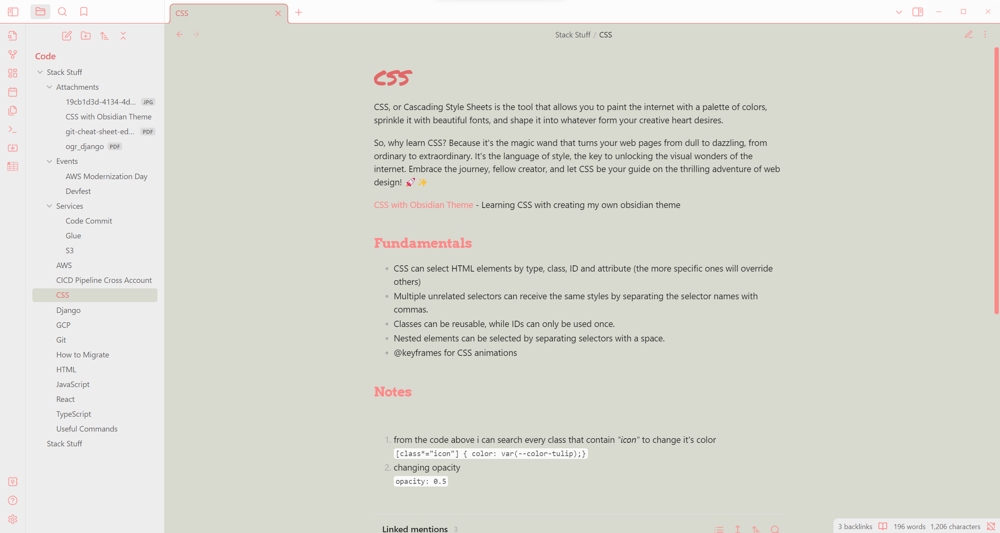
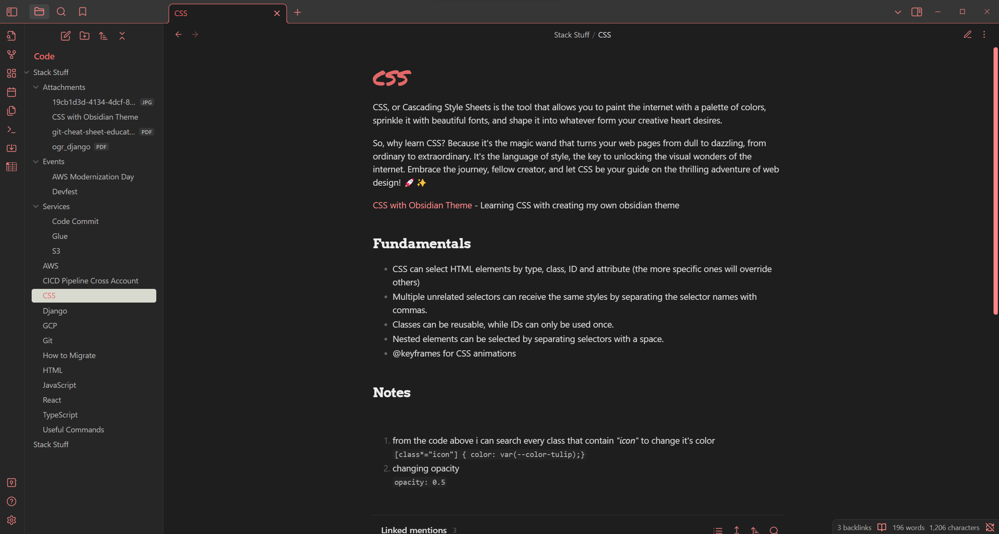

## Misty Mauve

This is my first theme and also my first time learning some CSS, hope you guys like my design.
Althought it's stil WIP, there's alot of stuff i want to try yet in this theme project.

The color palette is characterized by subtle and muted tones, blending the gentle grays of Timberwolf and Bright Gray with the delicate warmth of Tulip giving a chill vibes when you are making your notes.

And here's a song with the same title as the theme https://youtu.be/BgtHQtKSizw.

#### Light Color Scheme

#### Dark Color Scheme

