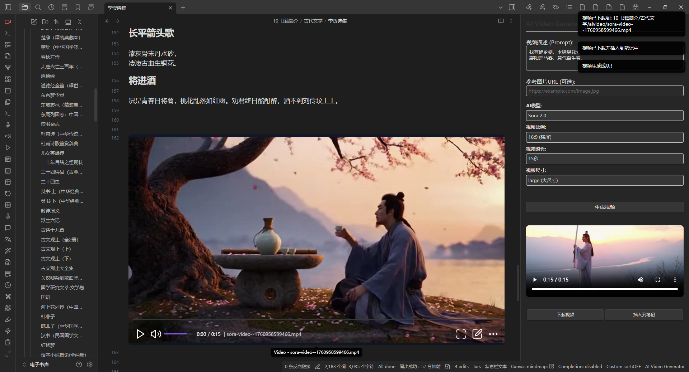

# AI Video Generator Plugin for Obsidian

这是一个为 Obsidian 设计的 AI 视频生成插件，使用 Sora2 模型来生成视频。

## 功能特性

-   🎬 使用 Sora2 模型生成高质量视频
-   📝 支持文本描述生成视频
-   🖼️ 支持参考图片生成视频
-   ⚙️ 可配置视频参数（比例、时长、清晰度）
-   📊 实时显示生成进度
-   👀 内置视频预览功能
-   💾 支持视频下载和插入到笔记
-   🔧 完整的设置页面

## 安装方法

### 从源码安装

1. 克隆此仓库
2. 运行 `npm i` 安装依赖
3. 运行 `npm run build` 编译插件
4. 将 `main.js`、`manifest.json` 和 `styles.css` 复制到您的 Obsidian 插件目录
5. 在 Obsidian 中启用插件

### 开发模式

1. 运行 `npm run dev` 启动开发模式
2. 修改 `main.ts` 文件
3. 重新加载 Obsidian 以加载新版本

## 使用方法

### 1. 配置 API 密钥

1. 打开 Obsidian 设置
2. 进入 "AI Video Generator" 设置页面
3. 输入您的 API 密钥
4. 选择 API 服务器（国内直连或海外）
5. 配置其他默认参数

### 2. 生成视频

#### 方法一：使用功能区图标

-   点击左侧功能区的视频图标
-   在弹出的对话框中输入视频描述
-   配置视频参数
-   点击"生成视频"按钮

#### 方法二：使用命令面板

-   按 `Ctrl+P`（或 `Cmd+P`）打开命令面板
-   搜索 "Generate AI Video"
-   选择命令并输入描述

#### 方法三：从选中文本生成

-   在笔记中选择要生成视频的文本
-   使用命令 "Generate video from selected text"

### 3. 视频参数说明

-   **视频比例**：16:9（横屏）或 9:16（竖屏）
-   **视频时长**：10 秒或 15 秒
-   **视频清晰度**：标准（small）或高清（large）
-   **参考图片**：可选的图片 URL，用于指导视频生成

### 4. 结果处理

生成完成后，您可以：

-   预览生成的视频
-   下载视频到本地
-   将视频插入到当前笔记中

## API 配置

### 获取 API 密钥

您需要从 API 提供商获取密钥。支持的 API 端点：

-   **国内直连**：`https://grsai.dakka.com.cn`
-   **海外**：`https://api.grsai.com`

### API 参数

插件支持以下 API 参数：

-   `model`: 固定为 "sora-2"
-   `prompt`: 视频描述（必填）
-   `url`: 参考图片 URL（可选）
-   `aspectRatio`: 视频比例（可选）
-   `duration`: 视频时长（可选）
-   `size`: 视频清晰度（可选）
-   `webHook`: 回调地址（可选）

## 技术实现

### 核心功能

1. **API 集成**：完整的 Sora2 API 集成
2. **进度监控**：实时显示生成进度
3. **错误处理**：完善的错误处理和用户提示
4. **界面设计**：现代化的用户界面
5. **设置管理**：完整的设置页面

### 文件结构

-   `main.ts` - 主要插件逻辑
-   `styles.css` - 样式文件
-   `manifest.json` - 插件元数据
-   `package.json` - 项目配置

如果这个插件对你有帮助，欢迎请作者喝杯咖啡。你的支持将用于持续维护与新功能开发：


## 示例与效果图

-   **示例视频**：

<video src="效果图/视频1.mp4" controls width="720" poster="效果图/图片1.png"></video>

-   **示例图片**：



## 开发说明

### 依赖项

-   TypeScript
-   Obsidian API
-   ESBuild（用于构建）

### 构建命令

```bash
# 开发模式
npm run dev

# 生产构建
npm run build

# 版本更新
npm run version
```

## 许可证

MIT License

## 贡献

欢迎提交 Issue 和 Pull Request！

## 更新日志

### v1.0.0

-   初始版本发布
-   支持 Sora2 视频生成
-   完整的用户界面
-   设置页面和配置管理
