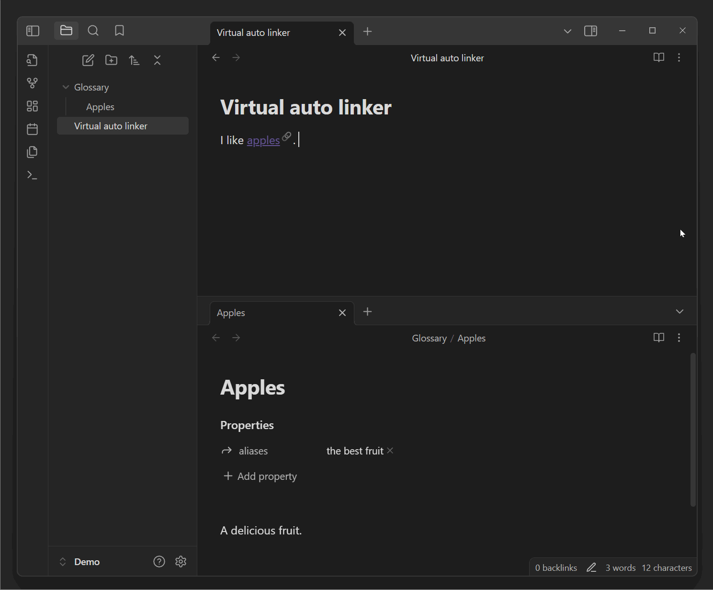

[](https://www.buymeacoffee.com/vschroeter) 
[](https://paypal.me/valentinschroeter)

# Obsidian Virtual Linker Plugin (Glossary Plugin)

This plugin automatically generates virtual links for text within your notes that match with the titles or aliases of other notes in your vault.

Features:
- create a glossary like functionality
- works in **edit mode** and **read mode**
- created links are **always up to date** 
- **no manual linking** necessary 
- works with **aliases** of notes
- links do not appear in graph view & reference counting
- updates the links automatically while you expand your vault or type new text
- convert the virtual links to real links in the context menu

Usage demo (literally just typing text ;-):


## Usage

By default, the plugin will automatically link all notes of your vault.
All occurrences of a note title or alias will be linked in your current note text.
If you only want to include notes of a specific folder, you can define this folder in the settings.

> [!Note]
> The auto generated links are post-processed, so they neither change your note text to hard-coded links enclosed in brackets not 
> appear in the graph view or reference counting.

## Installing the plugin

Inside obsidian, you can search for "Virtual Linker" in the community plugins tab.
After installing, enable the plugin in the settings.

To manually install the plugin:
- Copy over `main.js` & `manifest.json` (find them under `Releases`) to your vault `VaultFolder/.obsidian/plugins/virtual-linker/`.
- or clone the repository into the plugins folder of your vault and build the plugin yourself.

## Settings

## Matched files

You can toggle the matching of files between:
- "Match all files": All files in your vault are matched.
- "Match only files in a specific folder": Only files in a specific folder are matched. You can specify the folder in the settings. This is useful if you want to only create virtual links to notes in a dedicated glossary directory.

Furthermore, you can explicitly include or exclude specific files from being matched, by adding a tag to the file. You can change the tag in the settings, by default it is:
- `linker-include` to explicitly include a file
- `linker-exclude` to explicitly exclude a file

You can also exclude all files in a specific folder by adding the folder to the exclude list in the settings.

> [!Note]
> To include / exclude a file or folder, you can use the context menu on virtual links or in the file explorer.

### Case sensitivity
You can toggle the case sensitivity of the matching. By default, the matching is case insensitive.

Often there are words with mainly capitalized letters, that should be matched case sensitive. By default, words with 75% or more capitalized letters are matched case sensitive. You can change this threshold in the settings.

You can also explicitly change the case sensitivity of a specific file by adding a tag to the file. You can change the tag in the settings, by default it is:
- `linker-match-case` to make the matching case sensitive
- `linker-ignore-case` to make the matching case insensitive

If you want to define the case sensitivity for specific aliases, you can define the frontmatter property lists in a note:
- `linker-match-case` with a list of names that should be matched only case sensitive
- `linker-ignore-case` with a list of names that should be matched case insensitive 
These property names can be changed in the settings.

### Matching mode

#### Suppress multiple matching and matching to real links
By default, the plugin will suppress several identical virtual link in the same note.
Furthermore, you can toggle to suppress the creation of virtual links to files, that are linked by real links in the current note. 

#### Part matching
You can toggle the matching mode between:
- "Matching only whole words": Only whole words are matched. E.g. "book" will not match "Notebook".
- "Match also beginning of words": The beginning of a word is matched. E.g. "book" will not match "Notebook", but "Note" will match "Notebook".
- "Matching any part of a word": Any part of a word is matched. E.g. "book" will match "Notebook".

You furthermore have the option to suppress the link suffix for these matches to avoid cluttering your text.

#### Links to the note itself
By default, links to a note itself are suppressed.
This link suppression might be a bit buggy and not work in all cases, e.g. in preview windows.
If you like self-links to the note itself, you can toggle this behavior in the settings.

#### Link suppression in current line 
By default, links are created directly as you type.
You can disable links for the current line you are typing.

> [!Note]
> Deactivating the link creation for the current line is recommended when using the plugin with IME (input method editor) for languages like Chinese or Japanese, as the plugin might otherwise interfere with the IME.


### Styling of the links

Any created virtual link will be appended with this suffix. This is useful to distinguish between real and virtual links.
By default, the suffix is "🔗".

By default (and if the default styling is toggled on in the settings), the links appear a little bit darker than your normal links.
You can turn off this default styling in the settings.

To apply custom styling to the links, you can add a CSS-snippet at `VaultFolder/.obsidian/snippets/virtualLinks.css` file.

```css
/* Properties of the virtual link when not hovered */
.virtual-link.glossary-entry a {
    /* To have the normal text color when not hovered */
    color: inherit;

    /* Or add a color, e.g. red */
    /* color: red; */

    /* You can also change the underline of the link in thickness, color, and other properties */
    text-decoration-thickness: 1px;
    text-decoration-color: rgb(var(--color-purple-rgb), 0.6);
    text-underline-position: under;
    /* text-decoration-style: dotted; */
    /* text-underline-offset: 0em; */
}

/* Properties of the virtual link when hovered */
.virtual-link.glossary-entry a:hover {
    color: var(--link-color);
}
```

> [!Note]
> If you want to apply custom styling, don't forget to turn off the "Apply default link styling" in the settings.

## Commands

The plugin provides the following commands that you can use:

- **Convert All Virtual Links in Selection to Real Links**: Converts all virtual links within the selected text to real links.
- **Activate Virtual Linker**: Activates the virtual linker if it is currently deactivated.
- **Deactivate Virtual Linker**: Deactivates the virtual linker if it is currently activated.

You can access these commands from the command palette or assign custom hotkeys to them in the settings.

## Context Menu Options

When right-clicking on a virtual link, the following options are available in the context menu:

- **Convert to real link**: Converts the selected virtual link to a real link.
- **Exclude this file**: Adds the `linker-exclude` tag to the file, preventing it from being matched by the virtual linker.
- **Include this file**: Adds the `linker-include` tag to the file, ensuring it is matched by the virtual linker.

## How to use for development

- Clone this repo (into `your-vault/.obsidian/plugins/`).
- `yarn` to install dependencies
- `yarn dev` to start compilation in watch mode.
- `yarn build` to compile your `main.ts` into `main.js`.

It is recommended to use the [Hot Reload Plugin](https://github.com/pjeby/hot-reload) for development.
