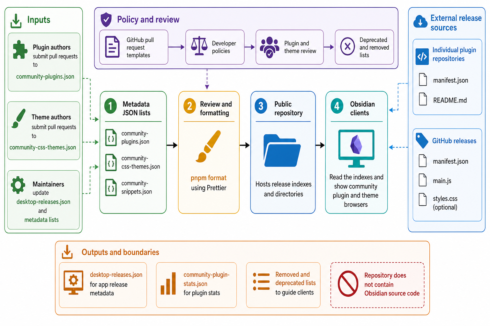

<div align="center">
  

  **🧩 Public release metadata for Obsidian plugins, themes, snippets, and desktop updates 🧩**
</div>

obsidian-releases hosts the public JSON indexes used by Obsidian release and community directory flows. It contains desktop release metadata, community plugin and theme listings, snippet metadata, plugin stats, and removed or deprecated entry lists.

This repository does not contain the Obsidian source code. Obsidian is not open source software, but community plugins and themes can be submitted through pull requests.

## Submit

Open a pull request, switch to **Preview**, and choose the plugin or theme checklist. All submissions must follow the [developer policies](https://docs.obsidian.md/Developer+policies).

- Plugins are added to `community-plugins.json`. Add entries to the end of the list with `id`, `name`, `author`, `description`, and `repo`.
- Themes are added to `community-css-themes.json`. Add entries to the end of the list with `name`, `author`, `repo`, `screenshot`, `modes`, and optional `publish`.
- Detailed submission docs are available for [plugins](https://docs.obsidian.md/Plugins/Releasing/Submit+your+plugin) and [themes](https://docs.obsidian.md/Themes/App+themes/Submit+your+theme).

For plugin or theme bugs, use the plugin or theme repository. For Obsidian app questions, use the [Obsidian community](https://obsidian.md/community).

## Install

```bash
git clone https://github.com/tsilva/obsidian-releases.git
cd obsidian-releases
pnpm install
```

Open the JSON files in the repository root. There is no local app server for this project.

## Commands

```bash
pnpm install  # install dependencies; pnpm is required
pnpm format   # format community*.json with Prettier
```

## Notes

- `pnpm` is required by the `preinstall` script and `packageManager` field.
- Obsidian reads `community-plugins.json` and uses each plugin's `name`, `author`, and `description` for search.
- Plugin detail pages pull `manifest.json` and `README.md` from the plugin repository.
- Plugin installs download release files from matching GitHub release tags: `manifest.json`, `main.js`, and optional `styles.css`.
- Theme authors can test Obsidian Publish compatibility with `applyCss` or `applyCssByLink` in the developer console of an Obsidian Publish site.

## Architecture



## License

[MIT](LICENSE)
